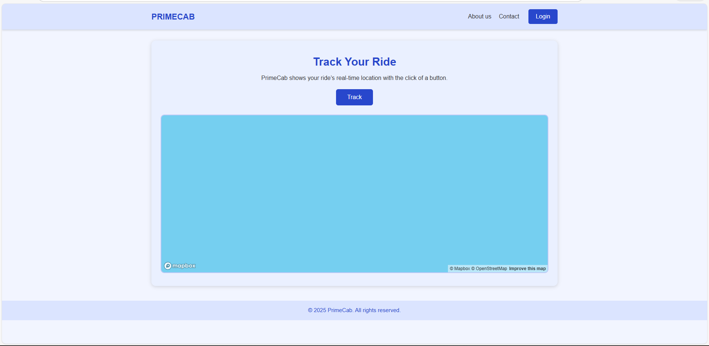
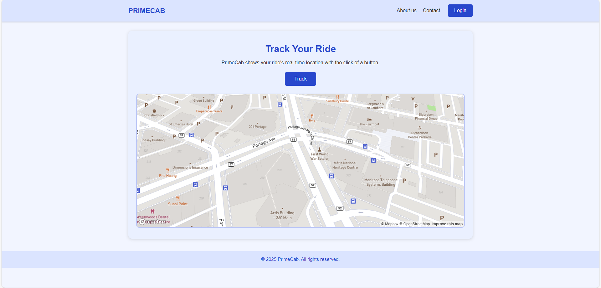

# PrimeCab – Real-Time GPS Tracking App

PrimeCab is a fictional transportation company created for **Assignment 4 (SD-105 – Third-Party APIs)**.  
This project demonstrates how to use the **Geolocation API** and **MapBox API** to show a device’s real-time location on a map.

---

##  Project Goals
This assignment shows how to:

- Build a clean and professional company webpage  
- Add a working **MapBox** map  
- Use the **Geolocation API** to get the user’s location  
- Update the map when the user clicks **Track**

---

##  Home Page (Before Clicking Track)

When the page loads, the map is displayed inside a styled container.

 **At first, the map is not showing your location yet**, because geolocation only runs after the user clicks **Track**.

### Screenshot:

---

##  Default Map Center (Winnipeg)

If the map center is set to `[0,0]`, MapBox shows an **empty blue ocean**.  
To avoid this, the map **starts centered on Winnipeg** using these coordinates:Winnipeg Center: [-97.1384, 49.8951]

This makes the map look normal before clicking **Track**, and it also demonstrates that we can manually set a map center.

### Screenshot:

---

##  Real-Time Tracking (After Clicking Track)

When the user clicks **Track**:

1. The Geolocation API asks for permission  
2. If allowed, the map moves to the user’s real location  
3. A blue marker appears at the correct position  
4. The map continues updating using `watchPosition()`  

### Screenshot:

---

##  How It Works (JavaScript Summary)

- MapBox loads a default map centered on Winnipeg  
- `navigator.geolocation.watchPosition()` gets the device’s real location  
- The map updates to the user’s coordinates  
- A marker moves to the correct location every time the device changes position  

## 🔗 Live Demo (GitHub Pages)

You can view the live version of the PrimeCab GPS Tracking App here:

https://daljitkaur08.github.io/ASSIGNMENT4daljitkaur/

